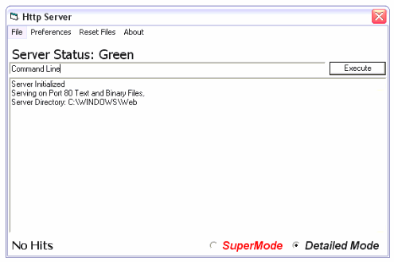



## The Web Server

### Description

With this program you can server Web Pages, Music, you can even host your web site on your computer. Has error handling, supports get requests. The php version is coming soon!
 
### More Info
 
All you have to do is set the Server Directory, and stick a index.html file in it, and the server will start processing request.

Be careful if you plan on serving a website, do not set the server directory to c:\. Also I uploaded this with the intention that people will modify it to explore and understand the code, so that they can make their own web server or just mod mine. Hey its got good framework to build off of. I am thinking of restarting it myself. And it is possible to add php support and I did It was just buggy so I took it out. But maybe you could perfect it. Have fun

The server passed all N-Stealth Vulnerability tests, so it is reasonably safe to use. This is compared to an IIS 5.0 test, in which N-stealth detected 157 vulnerabilities.

             |
---                |---
**Submitted On**   |2003-02-06 03:59:44
**By**             |[JokerDoom](https://github.com/Planet-Source-Code/PSCIndex/blob/master/ByAuthor/jokerdoom.md)
**Level**          |Intermediate
**User Rating**    |4.8 (24 globes from 5 users)
**Compatibility**  |VB 5\.0, VB 6\.0
**Category**       |[Complete Applications](https://github.com/Planet-Source-Code/PSCIndex/blob/master/ByCategory/complete-applications__1-27.md)
**World**          |[Visual Basic](https://github.com/Planet-Source-Code/PSCIndex/blob/master/ByWorld/visual-basic.md)
**Archive File**   |[Open\_Sourc154060272003\.zip](https://github.com/Planet-Source-Code/jokerdoom-the-web-server__1-43014/archive/master.zip)

